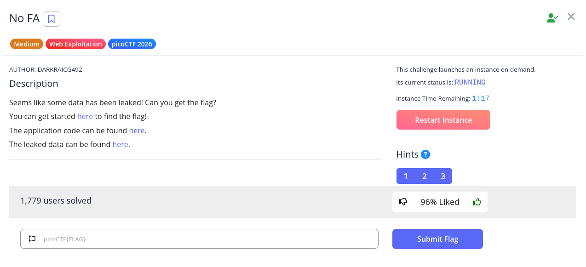
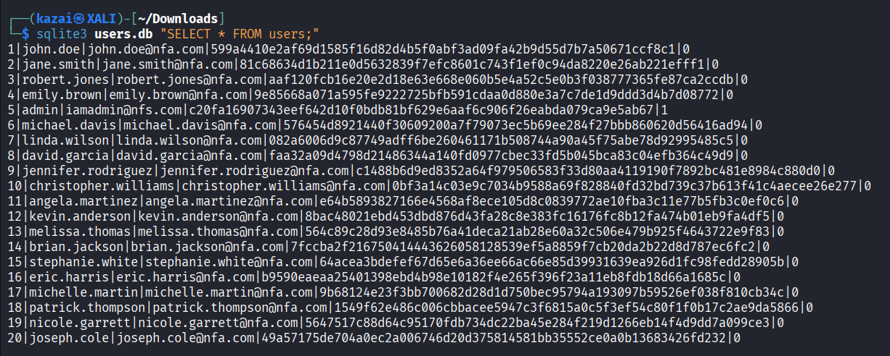
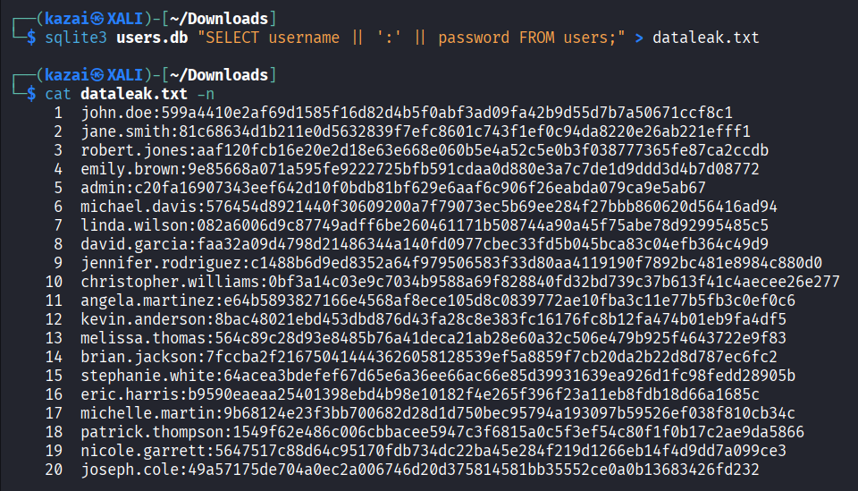
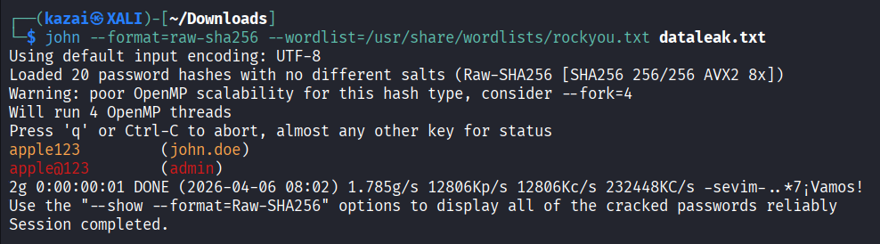
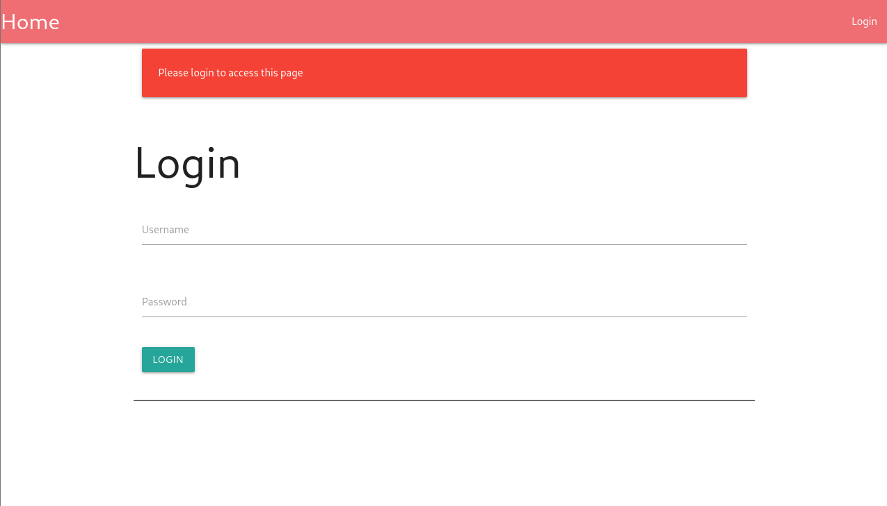
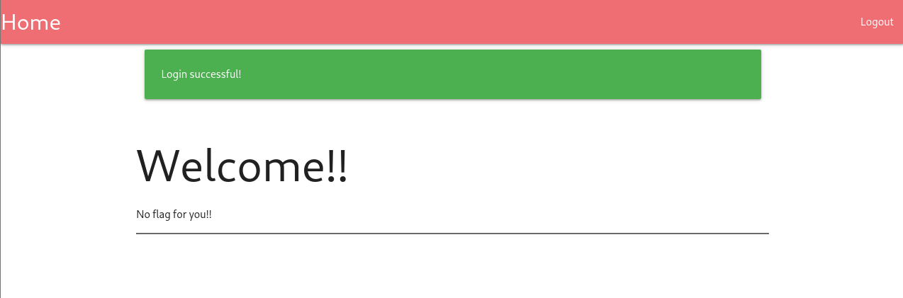
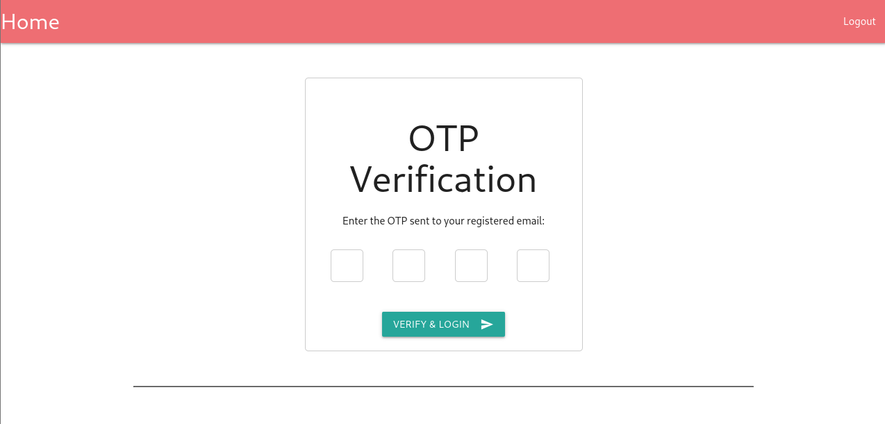
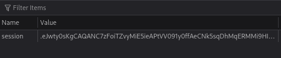
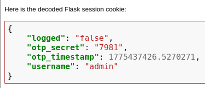
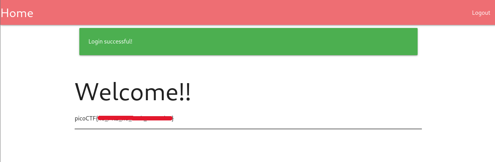

# No FA

| Detail | Info |
| --- | --- |
| **Platform** | PicoCTF |
| **Challenge** | No FA |
| **Difficulty** | Medium |
| **Category** | Web Exploitation |
| **Objective** | Crack leaked password hashes and bypass 2FA to log in as admin |
| **Tools Used** | John the Ripper · SQLite3 · Browser DevTools |

<br>

<p align="center">
  
</p>

## Reconnaissance

The challenge description said some data had been leaked and pointed us to three things: a running web instance with a login form, the application source code, and a leaked database file.

Before touching the login form, I went straight to the database. I opened it with SQLite3 and queried the users table.

```
sqlite3 users.db "SELECT * FROM users;"
```

<p align="center">
  
</p>

The table came back with 20 rows. Each row had an `id`, `username`, `email`, `password`, and a `two_fa` column. The passwords were stored as hashes, not plaintext. The `two_fa` column was `0` for most users, but `admin` had it set to `1`, which immediately told me the admin account was going to be harder to get into.

<br>

## Exploitation

### Step 1: Cracking the password hashes

The passwords are stored as raw SHA256 hashes with no salt, making them straightforward targets for a dictionary attack. The second hint pointed directly to **rockyou**, so I extracted the credentials into a format John the Ripper could work with:

```
sqlite3 users.db "SELECT username || ':' || password FROM users;" > dataleak.txt
```

<p align="center">
  
</p>

Then I identified the hash format and ran John against it using the rockyou wordlist:

```
john --format=raw-sha256 --wordlist=/usr/share/wordlists/rockyou.txt dataleak.txt
```

<p align="center">
  
</p>

John cracked two accounts:

- `john.doe` -> `apple123`
- `admin` -> `apple@123`

### Step 2: Testing with a regular account

<p align="center">
  
</p>

I logged in as `john.doe` first to verify the credentials worked. The login went through but the page just said *"No flag for you!!"*, which made sense since the flag is only shown to the admin account based on the source code:

<p align="center">
  
</p>

```python
flag = "No flag for you!!"
if session.get('username') == 'admin':
    flag = os.getenv('FLAG')
```

### Step 3: Bypassing the 2FA

Logging in as `admin` passed the password check, but the app then redirected to an OTP verification page.

<p align="center">
  
</p>

I checked the source code to understand how the OTP was being handled. In `app.py`, after a successful login, the server generates a 4-digit OTP using `random.randint(1000, 9999)` and stores it directly in the Flask session alongside the timestamp and login status:

```python
otp = str(random.randint(1000, 9999))
session['otp_secret'] = otp
session['otp_timestamp'] = time.time()
session['username'] = username
session['logged'] = 'false'
```

This is the flaw. Flask's default session is stored as a signed cookie on the client side, not on the server. The signature prevents tampering, but the contents are fully readable. The OTP is just sitting in the browser.

I opened DevTools (F12), went to Storage -> Cookies, and copied the session cookie value.

<p align="center">
  
</p>

I decoded it using a Flask session cookie decoder online.

<p align="center">
  
</p>

The decoded session revealed. I entered it into the verification form and logged in as admin. The flag appeared on the home page.

<p align="center">
  
</p>

<br>

## Findings & Recommendations

**1. Unsalted Password Hashes (High | [CVSS 7.5](https://www.first.org/cvss/calculator/3.1#CVSS:3.1/AV:N/AC:L/PR:N/UI:N/S:U/C:H/I:N/A:N))**

All passwords are stored as raw SHA256 hashes with no salt, making them highly vulnerable to dictionary attacks. Both cracked passwords in this challenge were found in under a second using rockyou.

Fix: Use a purpose-built password hashing library like `bcrypt`, `argon2`, or `scrypt`. These handle salting automatically and are intentionally slow to resist brute-force attacks.

```python
import bcrypt
hashed = bcrypt.hashpw(password.encode(), bcrypt.gensalt())
```

**2. OTP Stored in Client-Side Session Cookie (Critical | [CVSS 9.1](https://www.first.org/cvss/calculator/3.1#CVSS:3.1/AV:N/AC:L/PR:N/UI:N/S:U/C:H/I:H/A:N))**

The OTP and login status are stored entirely in a client-side Flask session cookie. While the cookie is signed with a `SECRET_KEY` to prevent tampering, the contents are still readable by anyone holding the cookie. Any secret stored in the session is exposed to the client.

Fix: Store OTPs server-side, tied to the user's session ID. The client should only hold a session reference, not the session data itself.

```python
# Server-side OTP storage (e.g. in-memory dict or Redis)
otp_store[session_id] = {
    "otp": otp,
    "expires_at": time.time() + 120
}
```

**3. Weak OTP Space (Medium | [CVSS 5.9](https://www.first.org/cvss/calculator/3.1#CVSS:3.1/AV:N/AC:H/PR:N/UI:N/S:U/C:H/I:N/A:N))**

The OTP is a 4-digit number generated with `random.randint(1000, 9999)`, giving only 9,000 possible values. On top of that, Python's `random` module is not cryptographically secure, making the OTP weak even if the session cookie issue were fixed.

Fix: Use `secrets` instead of `random`, and increase OTP length to 6 digits.

```python
import secrets
otp = str(secrets.randbelow(900000) + 100000)  # 6-digit OTP
```

<br>

## Lessons Learned

This challenge chained three separate weaknesses together. The unsalted hashes made cracking trivial. The 2FA looked like a hard stop until I read the source code and realized the OTP was stored client-side. Once I knew where to look, pulling the OTP from the session cookie was just a matter of opening DevTools.

The biggest takeaway was learning to read the application code rather than just attacking the interface. The vulnerability was not hidden; it was right there in `app.py`. Understanding how Flask session cookies work, and why storing secrets in them is a mistake, is something I will carry into every web challenge going forward.

It also reinforced the impact of unsalted hashes. With rockyou and John the Ripper, two passwords were cracked almost instantly. The difference between a hash falling in seconds versus years comes down to whether a proper algorithm and salt were used.

> Big thanks to the challenge author DARKRAICG492 for this one, a clean chain of vulnerabilities that each teaches something distinct.
